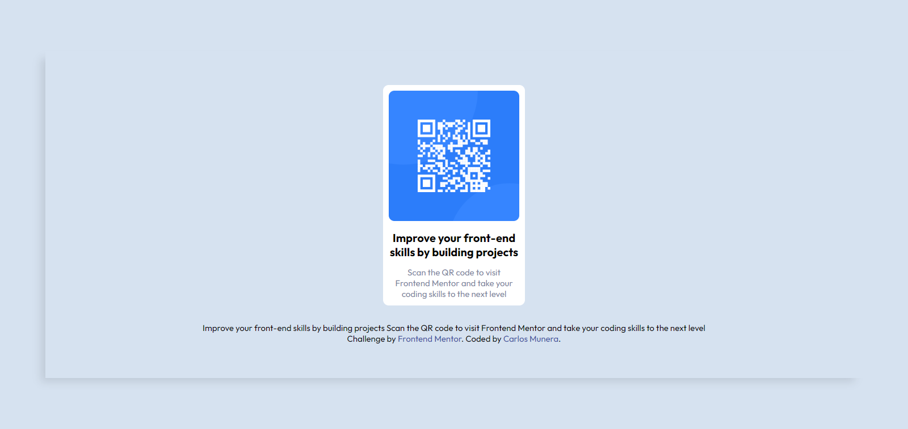

# Frontend Mentor - QR code component solution

Solución para el reto [QR code component challenge on Frontend Mentor](https://www.frontendmentor.io/challenges/qr-code-component-iux_sIO_H).

### Captura de pantalla

### Links

- URL de la solución: [Solución.](https://carlosmunera.github.io/1_qr-code-component-main_newbie/)

### Reto construido con:

- Semantic HTML5 markup
- CSS custom properties
- Flexbox
- Desktop-first workflow
- styles

## Author

- Frontend Mentor - [@CarlosMunera](https://www.frontendmentor.io/profile/CarlosMunera)

